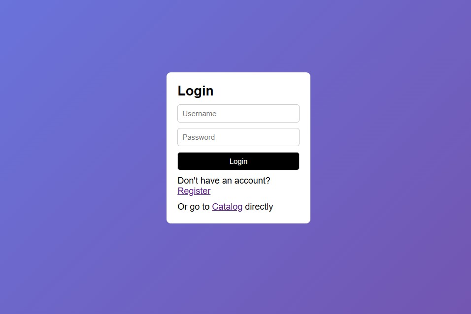
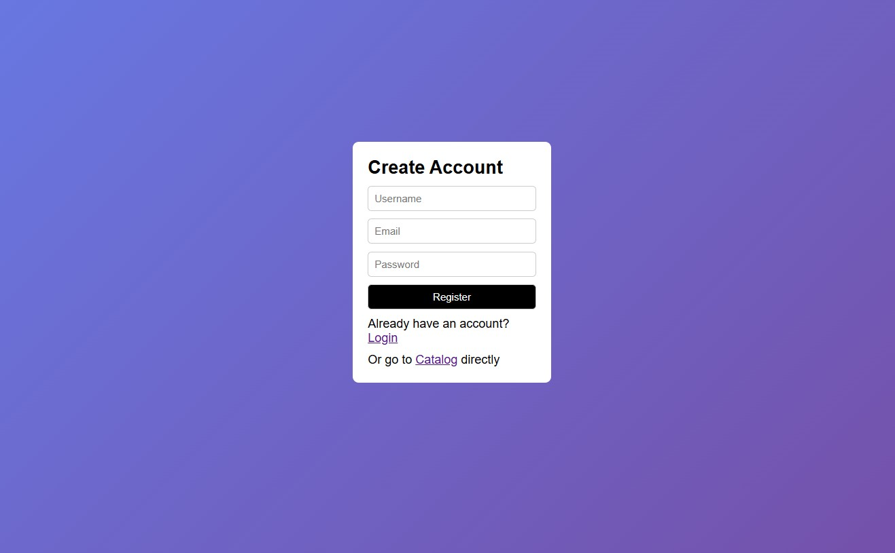
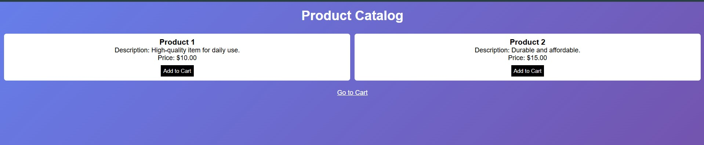

Question-1: Build a responsive shopping cart web application (registration, login,
catalog, cart) using CSS3 features, flex and grid. Publish the code on GitHub along with output screen shots

## Login Page

## Register Page

## Product Catalog

## Cart Page

